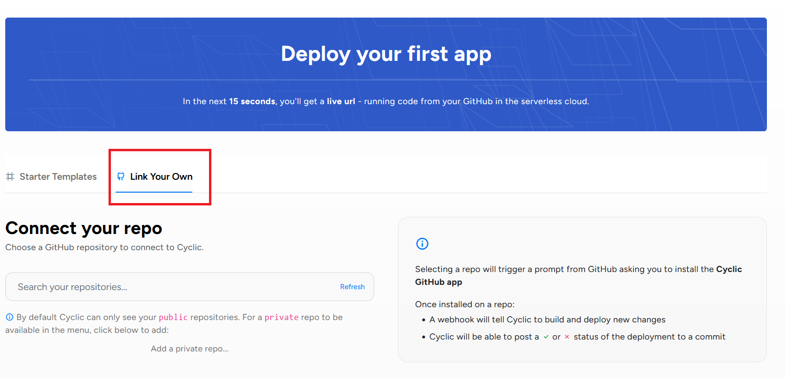
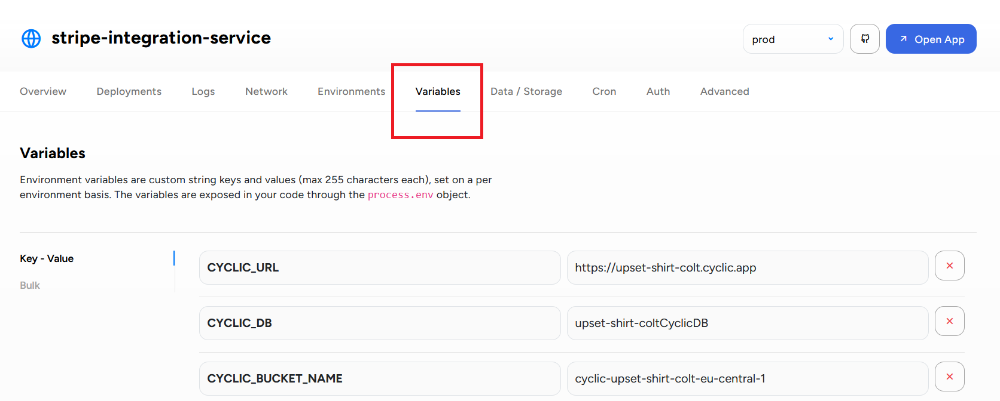

## Create Stripe account and products

Go to [`Stripe register page`](https://dashboard.stripe.com/register) and create an account, then verify your email.

To suggest some products or services (e.g different plans) your customers can subscribe to you need to create them in your Stripe dashboard. Go to [`Product catalog page`](https://dashboard.stripe.com/products?active=true) of Stripe dashboard and create your products.


## Stripe API key

Before using this service create .env file in the root of the project and copy the content of .env.example file there. Go to [`API keys page`](https://dashboard.stripe.com/test/apikeys), copy your Secret key and paste it to your .env file as a value of STRIPE_API_KEY variable.


## Start a service

To start a service locally you will need to run

npm install

npm run start:dev

## Retrieve products

To retrieve products which you created on the client side use:

GET /product/list

This call will return you an array of the product objects like this:

```js
{
  "id": "prod_NWjs8kKbJWmuuc",
  "object": "product",
  "active": true,
  "created": 1678833149,
  "prices": [...],
  ...
}
```

The product object has "prices" array with available prices for this product like this:

```js
{
  "id": "price_1MoBy5LkdIwHu7ixZhnattbh",
  "object": "price",
  "active": true,
  "billing_scheme": "per_unit",
  "created": 1679431181,
  "currency": "usd",
  ...
}
```

You will need the "id" of the price object to create the subscription.

## Create customer

Before your user can create a subscription to one of the products you have to create a customer entity in your Stripe project. For this use:

POST /customer/create

with the body

```js
type CustomerInfo = {|
  name: string,
  email: string,
|};
```

This call will return you the customer object like this:

```js
{
  "id": "cus_NffrFeUfNV2Hib",
  "object": "customer",
  "address": null,
  "balance": 0,
  "created": 1680893993,
  ...
}
```

You will be able to use an "id" of created customer to create a subscription.

## Create subscription

To create a subscription use:

POST /subscription/create

with the body

```js
type SubscriptionInfo = {|
  priceId: string, // The id of a price you got from /product/list request
  customerId: string, // The id from customer object you created before
|};
```

This call will return you the Subscription object with "clientSecret" field. You will need Client Secret to pass to Stripe Elements on the client side to procceed with payment and to confirm the subscription.

## Other functions

### Get subscription

To get information about a subscription use:

GET /subscription/:id

### Cancel subscription

To cancel a subscription use:

POST /subscription/cancel/:id

### Resume subscription

To resume a subscription after cancelling use:

POST /subscription/resume/:id

## Deployment to Cyclic

You can deploy the service to Cyclic for free.

For this you should sign up to Cyclic with your Github account. Then choose Link Your Own tab.



Choose the repository under "Connect your repo", then clock "Connect Cyclic".

In the App Dashboard of Cyclic you can set your environment variables under "Variables" tab.



## Demo

[Watch the video](https://www.loom.com/embed/a0b324e5be524503b4da60db2d06a52d?sid=f2fd1901-8098-4351-99ed-455a0b0856e4)
